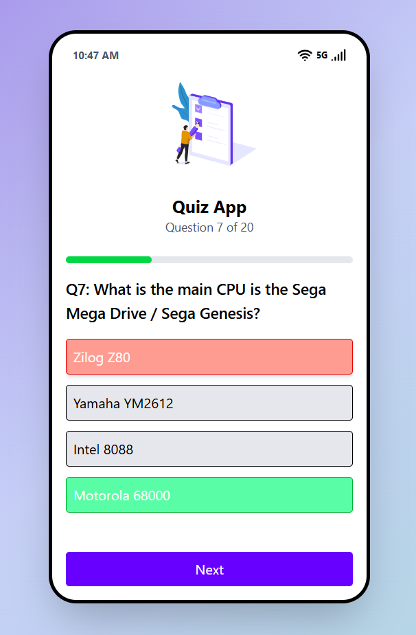

# QuickQuiz 🎮

**QuickQuiz** is an engaging and fast-paced quiz app designed to sharpen your knowledge across various topics. With quick-fire questions and instant feedback, QuickQuiz makes learning fun and competitive. 

# Preview

## 🚀 Tech Stack

**QuickQuiz** is built using the following technologies:

### 🖥️ Frontend:
- **React.js**: JavaScript library for building dynamic user interfaces.
- **Tailwind CSS**: A utility-first CSS framework for rapid custom styling.

### 🔧 Build Tool:
- **Vite**: Fast and efficient build tool optimized for modern web development.

### 🔤 TypeScript:
- **TypeScript**: Adds static typing to JavaScript for improved code quality and maintainability.

## 🌐 API Integration

**QuickQuiz** fetches trivia questions and categories from the **Open Trivia Database API**. The API offers a wide selection of trivia questions across various categories.

### 🏆 API Used:
- **[Open Trivia Database API](https://opentdb.com/)**: A free API that provides trivia questions in multiple categories.

